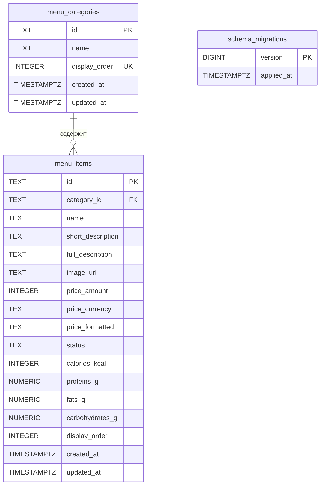
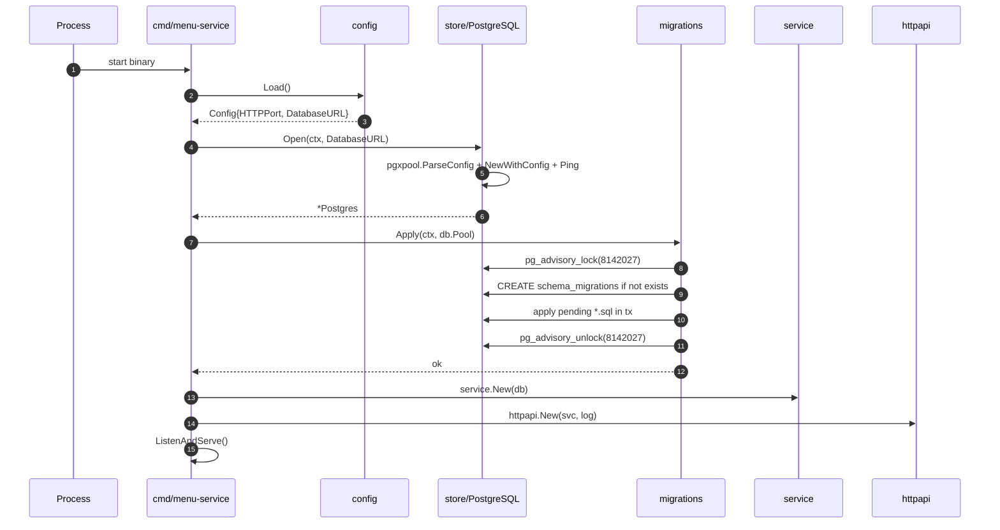
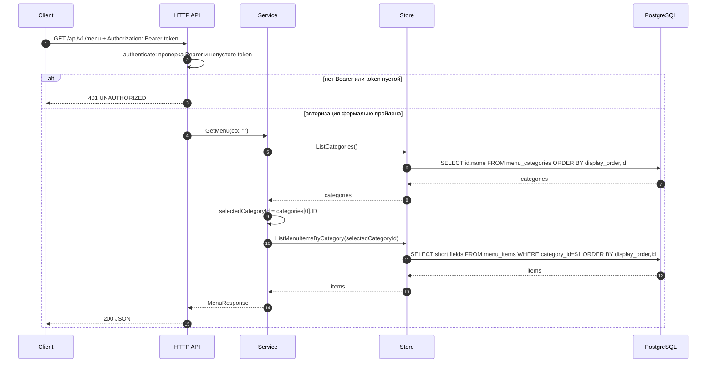
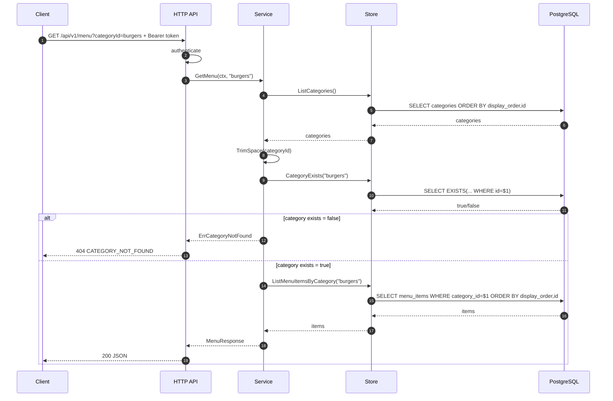
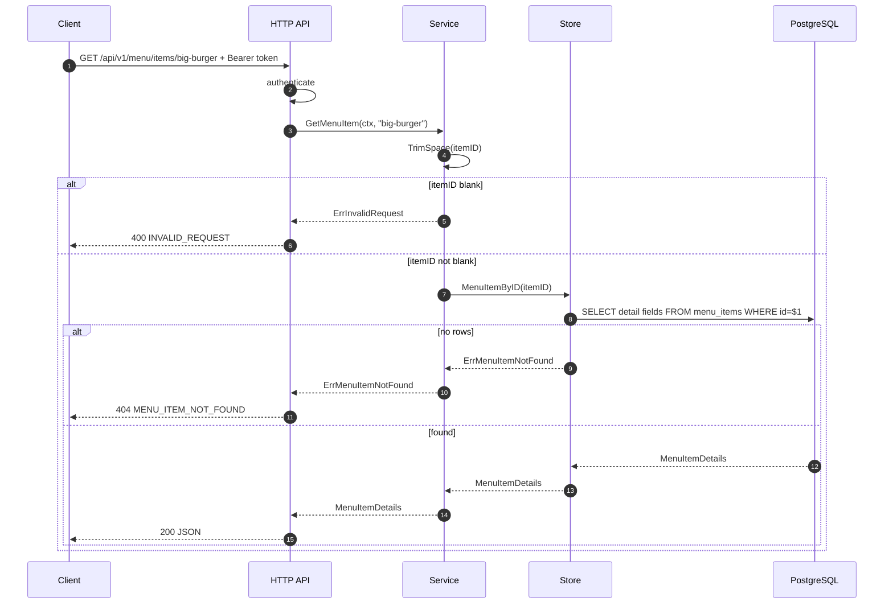

# Сервис меню `restaurant-menu-service`
### Документация системного аналитика

**Репозиторий:** `https://github.com/pavelgr1408/menu-service-go` (ветка `master`)  
**Технологический стек:** Go 1.24 в Dockerfile, Go module `go 1.23.0`, PostgreSQL 18, `net/http`, pgx v5, Docker Compose, embedded SQL migrations.  
**Назначение:** read-only микросервис меню онлайн-ресторана: хранение категорий и позиций меню, выдача списка меню и детальной карточки блюда через REST API.

---

## 1. Назначение и границы системы

`restaurant-menu-service` — отдельный микросервис платформы онлайн-ресторана, отвечающий за **публичное представление меню**: категории, краткие карточки позиций и детальные карточки блюд с описанием, ценой, статусом доступности и пищевой ценностью.

Сервис решает следующие задачи:

- хранит справочник категорий меню;
- хранит позиции меню, привязанные к категориям;
- возвращает список категорий и позиции выбранной категории;
- выбирает первую категорию по `display_order`, если клиент не передал `categoryId`;
- возвращает детальную карточку позиции меню по `itemId`;
- обеспечивает стабильную сортировку категорий и позиций через `display_order`;
- отдаёт единый JSON-формат ошибок;
- запускает SQL-миграции при старте сервиса;
- работает локально через Docker Compose вместе с PostgreSQL.

### Что НЕ входит в зону ответственности сервиса

- регистрация, login, refresh-token, выпуск и валидация JWT;
- управление пользователями, ролями, профилями и адресами;
- корзина, оформление заказа, оплата, доставка;
- CRUD-администрирование меню;
- проверка подписи JWT и авторизация по ролям;
- загрузка и хранение изображений;
- пагинация, поиск, фильтры, рекомендации, модификаторы блюд.

В текущей версии сервис проверяет только наличие заголовка `Authorization` формата `Bearer <token>` для бизнес-методов меню. Подпись токена не проверяется. Это приемлемо для учебного MVP, но для production это слабое место: проверка должна быть перенесена в API Gateway либо реализована через JWKS/introspection auth-сервиса.

---

## 2. Глоссарий

| Термин | Определение |
|---|---|
| **Категория меню** | Группа позиций меню: `burgers`, `chicken`, `drinks` и т. п. |
| **Позиция меню** | Конкретное блюдо/напиток/соус, принадлежащее категории. |
| **Краткая карточка** | Представление позиции в списке: id, categoryId, name, shortDescription, imageUrl, price, status. Не содержит `fullDescription` и `nutrition`. |
| **Детальная карточка** | Полное представление позиции: краткие поля + `fullDescription` и `nutrition`. |
| **Цена** | Структура `amount`, `currency`, `formatted`; для RUB `amount` хранится в копейках. |
| **Nutrition / КБЖУ** | Калории, белки, жиры, углеводы. Отдаётся только в детальной карточке. |
| **display_order** | Внутреннее поле БД для сортировки. В JSON API не возвращается. |
| **AVAILABLE** | Позиция доступна к заказу. |
| **UNAVAILABLE** | Позиция временно недоступна, но всё равно может быть показана клиенту. |
| **Bearer token** | Строка в заголовке `Authorization`. В MVP проверяется только наличие и непустота. |

---

## 3. Архитектура (нотация C4)

### 3.1. Уровень 2 — Контейнерная диаграмма

```plantuml
@startuml C4_Container_MenuService
!include https://raw.githubusercontent.com/plantuml-stdlib/C4-PlantUML/master/C4_Container.puml

title Контейнерная диаграмма — restaurant-menu-service

Person(customer, "Клиент", "Пользователь онлайн-ресторана")
Person(admin, "Администратор", "Пользователь панели управления; в текущем MVP CRUD меню отсутствует")

System_Boundary(platform, "Платформа онлайн-ресторана") {
    Container(clientApp, "Клиентское приложение", "Web / Mobile", "Получает категории, список блюд и карточку блюда")
    Container(apiGateway, "API Gateway / Auth boundary", "Reverse proxy / Gateway", "В production должен проверять JWT и прокидывать запросы дальше")
    Container(authService, "Auth Service", "Go", "Регистрация, login, refresh, выпуск JWT; не входит в menu-service")
    Container(menuService, "Menu Service", "Go 1.24, net/http", "Read-only API меню: категории, список позиций, детальная карточка")
    ContainerDb(db, "PostgreSQL", "PostgreSQL 18", "menu_categories, menu_items, schema_migrations")
}

Rel(customer, clientApp, "Использует")
Rel(clientApp, authService, "Получает Bearer access token", "HTTPS, JSON")
Rel(clientApp, apiGateway, "Запрашивает меню с Bearer token", "HTTPS, JSON")
Rel(apiGateway, menuService, "Проксирует GET /api/v1/menu и /items/{itemId}", "HTTP, JSON")
Rel(menuService, db, "Читает категории и позиции", "TCP, pgx")
Rel(admin, clientApp, "В будущем управляет меню", "Web")

@enduml
```

### 3.2. Уровень 3 — Компонентная диаграмма

```plantuml
@startuml C4_Component_MenuService
!include https://raw.githubusercontent.com/plantuml-stdlib/C4-PlantUML/master/C4_Component.puml

title Компонентная диаграмма — Menu Service (Go)

Container(clientApp, "Клиентское приложение", "Web / Mobile")
ContainerDb(db, "PostgreSQL", "PostgreSQL 18")

Container_Boundary(menu, "Menu Service (Go)") {
    Component(main, "Entrypoint", "cmd/menu-service/main.go", "Загружает config, открывает БД, применяет миграции, собирает service/httpapi, запускает HTTP server")
    Component(config, "Config", "internal/config", "Читает ENV и строит DATABASE_URL")
    Component(httpapi, "HTTP API / Router", "internal/httpapi", "Роуты, Bearer middleware, JSON, обработка ошибок, request logging, recover")
    Component(service, "Menu Service Logic", "internal/service", "Выбор категории, получение списка меню, получение детальной карточки")
    Component(store, "Store / Repository", "internal/store", "SQL-запросы к PostgreSQL через pgxpool")
    Component(domain, "Domain Model", "internal/domain", "DTO, статусы, коды ошибок и доменные ошибки")
    Component(migrations, "Migrations Runner", "migrations", "embed.FS, schema_migrations, advisory lock, версионированные SQL")
}

Rel(clientApp, httpapi, "GET /health, GET /api/v1/menu, GET /api/v1/menu/items/{itemId}", "HTTP, JSON")
Rel(main, config, "Load")
Rel(main, store, "Open")
Rel(main, migrations, "Apply")
Rel(main, service, "New")
Rel(main, httpapi, "New")
Rel(httpapi, service, "GetMenu / GetMenuItem")
Rel(service, store, "Repository interface")
Rel(service, domain, "Использует DTO и ошибки")
Rel(store, domain, "Маппинг строк БД в DTO")
Rel(store, db, "SQL", "pgx/v5")
Rel(migrations, db, "DDL + seed", "SQL")

@enduml
```

### 3.3. Слоистая архитектура

```text
cmd/menu-service
    └── internal/config
    └── migrations
    └── internal/httpapi ──► internal/service ──► internal/store ──► PostgreSQL
                                  │                    │
                                  └──► internal/domain ◄┘
```

| Слой | Пакет | Ответственность |
|---|---|---|
| Точка входа | `cmd/menu-service` | Сборка зависимостей, запуск HTTP-сервера, graceful shutdown |
| Конфигурация | `internal/config` | ENV, DATABASE_URL, параметры PostgreSQL |
| HTTP API | `internal/httpapi` | Роутинг, JSON, middleware авторизации, маппинг ошибок, логирование |
| Бизнес-логика | `internal/service` | Сценарии получения меню и карточки позиции |
| Хранилище | `internal/store` | SQL-запросы, маппинг данных PostgreSQL в DTO |
| Домен | `internal/domain` | Контракты API, статусы, доменные ошибки |
| Миграции | `migrations` | Создание схемы и seed-данные |

---

## 4. Модель данных

### 4.1. ER-диаграмма



### 4.2. Таблица `menu_categories`

| Поле | Тип | Ограничения | Назначение |
|---|---|---|---|
| `id` | `TEXT` | `PRIMARY KEY`, not blank | Публичный стабильный идентификатор категории |
| `name` | `TEXT` | `NOT NULL`, not blank | Отображаемое название категории |
| `display_order` | `INTEGER` | `NOT NULL`, `>= 0`, unique index | Порядок показа категорий |
| `created_at` | `TIMESTAMPTZ` | `NOT NULL DEFAULT NOW()` | Дата создания записи |
| `updated_at` | `TIMESTAMPTZ` | `NOT NULL DEFAULT NOW()` | Дата обновления записи |

Индексы:

- `ux_menu_categories_display_order` — уникальность порядка категорий.

### 4.3. Таблица `menu_items`

| Поле | Тип | Ограничения | Назначение |
|---|---|---|---|
| `id` | `TEXT` | `PRIMARY KEY`, not blank | Публичный идентификатор позиции |
| `category_id` | `TEXT` | `NOT NULL REFERENCES menu_categories(id)` | Категория позиции |
| `name` | `TEXT` | `NOT NULL`, not blank | Название позиции |
| `short_description` | `TEXT` | `NOT NULL` | Краткое описание для списка |
| `full_description` | `TEXT` | `NOT NULL` | Полное описание для карточки |
| `image_url` | `TEXT` | `NOT NULL` | URL изображения |
| `price_amount` | `INTEGER` | `NOT NULL`, `>= 0` | Цена в минимальных единицах валюты |
| `price_currency` | `TEXT` | `NOT NULL`, not blank | Валюта цены |
| `price_formatted` | `TEXT` | `NOT NULL` | Готовая строка цены для клиента |
| `status` | `TEXT` | `AVAILABLE` / `UNAVAILABLE` | Доступность позиции |
| `calories_kcal` | `INTEGER` | `NOT NULL`, `>= 0` | Калории |
| `proteins_g` | `NUMERIC(6,2)` | `NOT NULL`, `>= 0` | Белки, г |
| `fats_g` | `NUMERIC(6,2)` | `NOT NULL`, `>= 0` | Жиры, г |
| `carbohydrates_g` | `NUMERIC(6,2)` | `NOT NULL`, `>= 0` | Углеводы, г |
| `display_order` | `INTEGER` | `NOT NULL`, `>= 0` | Порядок позиции внутри категории |
| `created_at` | `TIMESTAMPTZ` | `NOT NULL DEFAULT NOW()` | Дата создания |
| `updated_at` | `TIMESTAMPTZ` | `NOT NULL DEFAULT NOW()` | Дата обновления |

Индексы:

- `ix_menu_items_category_id_display_order` — быстрый список позиций категории в нужном порядке;
- `ux_menu_items_category_display_order` — уникальность порядка внутри категории.

### 4.4. Seed-данные

Категории:

| display_order | id | name |
|---:|---|---|
| 10 | `burgers` | Бургеры |
| 20 | `chicken` | Курица |
| 30 | `potatoes-and-snacks` | Картофель и закуски |
| 40 | `drinks` | Напитки |
| 50 | `desserts` | Десерты |
| 60 | `sauces` | Соусы |

Позиции:

| id | category_id | status | price |
|---|---|---|---|
| `big-burger` | `burgers` | `AVAILABLE` | 299 ₽ |
| `cheese-burger` | `burgers` | `AVAILABLE` | 159 ₽ |
| `double-burger` | `burgers` | `UNAVAILABLE` | 349 ₽ |
| `chicken-burger` | `chicken` | `AVAILABLE` | 219 ₽ |
| `nuggets` | `chicken` | `AVAILABLE` | 189 ₽ |
| `french-fries` | `potatoes-and-snacks` | `AVAILABLE` | 119 ₽ |
| `cola` | `drinks` | `AVAILABLE` | 99 ₽ |
| `orange-juice` | `drinks` | `AVAILABLE` | 129 ₽ |
| `ice-cream` | `desserts` | `AVAILABLE` | 109 ₽ |
| `apple-pie` | `desserts` | `AVAILABLE` | 99 ₽ |
| `cheese-sauce` | `sauces` | `AVAILABLE` | 49 ₽ |
| `barbecue-sauce` | `sauces` | `AVAILABLE` | 49 ₽ |

---

## 5. Функциональные требования и API

Базовый URL локально: `http://localhost:18082`.  
Внутренний порт контейнера: `8080`.  
Формат обмена: `application/json;charset=UTF-8`.

| Метод | Путь | Доступ | Назначение |
|---|---|---|---|
| `GET` | `/health` | публичный | Проверка доступности HTTP API |
| `GET` | `/api/v1/menu` | Bearer token | Список категорий и позиции первой категории |
| `GET` | `/api/v1/menu?categoryId={categoryId}` | Bearer token | Список категорий и позиции выбранной категории |
| `GET` | `/api/v1/menu/items/{itemId}` | Bearer token | Детальная карточка позиции меню |

### 5.1. Авторизация

Для `/api/v1/menu` и `/api/v1/menu/items/{itemId}` требуется заголовок:

```http
Authorization: Bearer <token>
```

Текущая реализация проверяет только два условия:

1. заголовок начинается с `Bearer `;
2. токен после `Bearer ` не пустой после `trimSpace`.

Подпись JWT, срок действия, issuer, audience и роли не проверяются.

### 5.2. `GET /health`

Назначение: проверка, что HTTP-сервер запущен.

Особенность: endpoint не проверяет соединение с PostgreSQL в момент запроса. БД проверяется при старте сервиса через `store.Open`, а `/health` всегда возвращает `OK`, если HTTP handler доступен.

Ответ `200`:

```json
{
  "service": "restaurant-menu-service",
  "status": "OK"
}
```

### 5.3. `GET /api/v1/menu`

Назначение: вернуть список всех категорий и позиции выбранной категории. Если `categoryId` не передан или состоит из пробелов, сервис выбирает первую категорию из БД по `display_order, id`.

Запрос:

```http
GET /api/v1/menu
Authorization: Bearer test-token
Accept: application/json
```

Ответ `200`:

```json
{
  "selectedCategoryId": "burgers",
  "categories": [
    { "id": "burgers", "name": "Бургеры" },
    { "id": "chicken", "name": "Курица" },
    { "id": "potatoes-and-snacks", "name": "Картофель и закуски" },
    { "id": "drinks", "name": "Напитки" },
    { "id": "desserts", "name": "Десерты" },
    { "id": "sauces", "name": "Соусы" }
  ],
  "items": [
    {
      "id": "big-burger",
      "categoryId": "burgers",
      "name": "Большой бургер",
      "shortDescription": "Бургер с говяжьей котлетой, сыром, салатом и фирменным соусом",
      "imageUrl": "https://cdn.example.com/menu/items/big-burger.png",
      "price": {
        "amount": 29900,
        "currency": "RUB",
        "formatted": "299 ₽"
      },
      "status": "AVAILABLE"
    }
  ]
}
```

Гарантированно не возвращаются поля:

- `fullDescription`;
- `nutrition`;
- `display_order`;
- `sortOrder`;
- `isDefault`;
- `pagination`.

### 5.4. `GET /api/v1/menu?categoryId={categoryId}`

Назначение: вернуть список всех категорий и позиции конкретной категории.

Параметры query:

| Параметр | Тип | Обязательность | Описание |
|---|---|---|---|
| `categoryId` | string | нет | ID категории. Если не передан — выбирается первая категория. Если неизвестен — `404 CATEGORY_NOT_FOUND`. |

Пример:

```http
GET /api/v1/menu?categoryId=burgers
Authorization: Bearer test-token
```

Ответ `200`: структура такая же, как у `/api/v1/menu`, но `selectedCategoryId` равен переданному `categoryId`, а `items` содержит позиции этой категории.

Ошибка `404`:

```json
{
  "error": {
    "code": "CATEGORY_NOT_FOUND",
    "message": "Категория меню не найдена"
  }
}
```

### 5.5. `GET /api/v1/menu/items/{itemId}`

Назначение: вернуть детальную карточку позиции меню.

Path parameters:

| Параметр | Тип | Обязательность | Описание |
|---|---|---|---|
| `itemId` | string | да | ID позиции меню. |

Пример:

```http
GET /api/v1/menu/items/big-burger
Authorization: Bearer test-token
```

Ответ `200`:

```json
{
  "id": "big-burger",
  "categoryId": "burgers",
  "name": "Большой бургер",
  "shortDescription": "Бургер с говяжьей котлетой, сыром, салатом и фирменным соусом",
  "fullDescription": "Большой бургер с говяжьей котлетой, сыром, свежим салатом, маринованными огурцами и фирменным соусом в булочке с кунжутом.",
  "imageUrl": "https://cdn.example.com/menu/items/big-burger.png",
  "price": {
    "amount": 29900,
    "currency": "RUB",
    "formatted": "299 ₽"
  },
  "status": "AVAILABLE",
  "nutrition": {
    "caloriesKcal": 540,
    "proteinsG": 27.5,
    "fatsG": 29.1,
    "carbohydratesG": 42.4
  }
}
```

Ошибка `404`:

```json
{
  "error": {
    "code": "MENU_ITEM_NOT_FOUND",
    "message": "Позиция меню не найдена"
  }
}
```

---

## 6. Модель ошибок

Единый формат ошибки:

```json
{
  "error": {
    "code": "ERROR_CODE",
    "message": "Описание ошибки"
  }
}
```

| HTTP | code | Message | Когда возникает |
|---:|---|---|---|
| 400 | `INVALID_REQUEST` | `Некорректный запрос` | В бизнес-логике передан пустой `itemId`; практически недостижимо через текущий роут `/items/{itemId}` |
| 401 | `UNAUTHORIZED` | `Требуется заголовок Authorization: Bearer <token>` | Нет заголовка или он не начинается с `Bearer ` |
| 401 | `UNAUTHORIZED` | `Требуется непустой Bearer-токен` | Заголовок начинается с `Bearer `, но токен пустой |
| 404 | `CATEGORY_NOT_FOUND` | `Категория меню не найдена` | Передан неизвестный `categoryId` |
| 404 | `MENU_ITEM_NOT_FOUND` | `Позиция меню не найдена` | Передан неизвестный `itemId` |
| 500 | `INTERNAL_ERROR` | `Внутренняя ошибка сервиса` | Ошибка БД, panic или другая непредвиденная ошибка |

Критическое замечание: `domain.ErrUnauthorized` объявлен, но в текущей бизнес-логике не используется. Реальная авторизация обрабатывается напрямую в HTTP middleware.

---

## 7. Диаграммы выполнения методов

### 7.1. Старт сервиса



### 7.2. Получение меню без `categoryId`



### 7.3. Получение меню по конкретной категории



### 7.4. Получение детальной карточки позиции



---

## 8. Нефункциональные требования и характеристики реализации

### 8.1. Производительность

- Сервис read-only: в текущем API нет мутаций, транзакций на бизнес-запросах и тяжёлых вычислений.
- `pgxpool` настроен на `MaxConns=20`, `MinConns=2`, `MaxConnLifetime=1h`.
- Список категорий запрашивается каждый раз при вызове `/api/v1/menu`; кеширования нет.
- Позиции категории сортируются на стороне БД по `display_order, id`.

### 8.2. Надёжность

- При старте выполняется `Ping` PostgreSQL; если БД недоступна, сервис завершает процесс.
- Миграции применяются под `pg_advisory_lock(8142027)`, что защищает от конкурентного применения миграций несколькими инстансами.
- Каждая миграция выполняется в отдельной транзакции и записывается в `schema_migrations`.
- HTTP server имеет таймауты: `ReadHeaderTimeout=5s`, `ReadTimeout=15s`, `WriteTimeout=15s`, `IdleTimeout=60s`.
- Есть graceful shutdown с таймаутом 10 секунд.

### 8.3. Наблюдаемость

- Логи пишутся через `log/slog` в JSON.
- Middleware `requestLogger` логирует `method`, `path`, `status`, `duration_ms`.
- Panic перехватывается middleware `recover` и возвращается как `500 INTERNAL_ERROR`.
- Нет метрик Prometheus, trace-id/correlation-id и structured error-id.

### 8.4. Безопасность

Текущее состояние подходит для MVP, но не для production без доработок:

- Bearer token не валидируется криптографически;
- роли и права не проверяются;
- `/health` не проверяет БД;
- отсутствует rate limiting;
- отсутствуют CORS-настройки;
- отсутствуют security headers;
- нет аудита доступа;
- `image_url` хранится как строка без проверки домена.

---

## 9. Конфигурация и запуск

### 9.1. Переменные окружения

| Переменная | Значение по умолчанию | Назначение |
|---|---|---|
| `HTTP_PORT` | `8080` | Порт HTTP-сервера внутри контейнера |
| `DATABASE_HOST` | `localhost` | Хост PostgreSQL |
| `DATABASE_PORT` | `15434` | Порт PostgreSQL при локальном запуске без Docker Compose |
| `DATABASE_NAME` | `restaurant_menu_db` | Имя БД |
| `DATABASE_USER` | `restaurant_menu_user` | Пользователь БД |
| `DATABASE_PASSWORD` | `restaurant_menu_password` | Пароль БД |
| `DATABASE_SSLMODE` | `disable` | SSL mode |
| `DATABASE_URL` | пусто | Если задан, имеет приоритет над раздельными переменными |
| `MENU_SERVICE_PORT` | `18082` | Внешний порт сервиса в Docker Compose |
| `MENU_POSTGRES_PORT` | `15434` | Внешний порт PostgreSQL в Docker Compose |

### 9.2. Docker Compose

Состав локального окружения:

| Контейнер | Образ / сборка | Порт host | Назначение |
|---|---|---:|---|
| `restaurant-menu-postgres` | `postgres:18` | `15434` | БД сервиса меню |
| `restaurant-menu-service` | local Dockerfile | `18082` | HTTP API меню |

Команды:

```bash
docker compose up --build
docker compose down
docker compose down -v
```

### 9.3. Makefile

```bash
make test
make build
make run
make compose-up
make compose-down
make compose-logs
make clean
```

---

## 10. Тестирование

В репозитории есть unit-тесты HTTP-слоя в `internal/httpapi/api_test.go`.

Покрытые сценарии:

| Тест | Проверка |
|---|---|
| `TestHealthIsPublic` | `/health` публичный и возвращает service name |
| `TestMenuRequiresAuthorization` | `/api/v1/menu` требует Authorization |
| `TestMenuListDoesNotExposeDetailsFields` | список меню не отдаёт детальные поля |
| `TestMenuItemDetailsExposeNutritionAndFullDescription` | карточка позиции отдаёт `fullDescription` и `nutrition` |
| `TestCategoryNotFound` | неизвестная категория возвращает `CATEGORY_NOT_FOUND` |
| `TestMenuItemNotFound` | неизвестная позиция возвращает `MENU_ITEM_NOT_FOUND` |

Недостатки тестового покрытия:

- нет тестов `internal/service` отдельно от HTTP;
- нет интеграционных тестов с PostgreSQL;
- нет теста на пустой Bearer token (`Authorization: Bearer    `);
- нет теста на отсутствие категорий в БД;
- нет тестов миграций;
- нет проверки content-type и формата ошибок на всех сценариях.

---

## 11. Аналитические замечания и риски

### 11.1. Несоответствие версий Go

В `go.mod` указано `go 1.23.0`, а в Dockerfile используется `golang:1.24-alpine`. Это не ломает сборку, но создаёт документационную и эксплуатационную неоднозначность. Рекомендация: синхронизировать версию Go в `go.mod`, Dockerfile и README.

### 11.2. README ссылается на `.env.example`, но файл не найден

В README сказано, что для локального запуска нужны переменные из `.env.example`, но при прямом запросе файла `.env.example` он не найден в ветке `master`. Рекомендация: добавить `.env.example` в репозиторий.

Пример содержимого:

```env
HTTP_PORT=8080
DATABASE_HOST=localhost
DATABASE_PORT=15434
DATABASE_NAME=restaurant_menu_db
DATABASE_USER=restaurant_menu_user
DATABASE_PASSWORD=restaurant_menu_password
DATABASE_SSLMODE=disable
MENU_SERVICE_PORT=18082
MENU_POSTGRES_PORT=15434
```

### 11.3. Health-check не проверяет БД

`GET /health` возвращает `OK` без `db.Ping`. Если PostgreSQL упадёт после старта, health останется зелёным. Для Kubernetes/Compose это может скрывать деградацию. Рекомендация: разделить:

- `/health/live` — жив ли процесс;
- `/health/ready` — доступна ли БД.

### 11.4. Авторизация формальная

Проверка только наличия Bearer token означает, что любой `Bearer abc` проходит. Для локального MVP это нормально, но для реальной системы нужно валидировать JWT или полагаться на gateway, который гарантирует валидацию до вызова сервиса.

### 11.5. Нет административных операций

Сервис хранит меню, но не предоставляет CRUD API. Это может быть осознанная граница MVP. Для production потребуется отдельный admin API или backoffice-service.

### 11.6. Нет механизма недоступности категории

Позиция может быть `UNAVAILABLE`, но категория статуса не имеет. Если все блюда категории недоступны, категория всё равно будет возвращаться.

### 11.7. Цена хранится одновременно в машинном и отображаемом виде

`price_amount`, `price_currency`, `price_formatted` хранятся в БД. Это удобно для MVP, но создаёт риск рассинхронизации. Более надёжно хранить `amount/currency`, а `formatted` формировать на уровне API/UI с учётом locale.

---

## 12. Рекомендации по развитию

Приоритет 1:

1. Добавить `.env.example`.
2. Синхронизировать Go version в `go.mod`, Dockerfile и README.
3. Разделить liveness/readiness.
4. Явно документировать, кто отвечает за JWT validation: gateway или сам сервис.
5. Добавить service-level unit tests.

Приоритет 2:

1. Добавить OpenAPI 3.0 спецификацию.
2. Добавить интеграционные тесты миграций и SQL-запросов.
3. Добавить correlation-id в логи.
4. Добавить метрики Prometheus.
5. Добавить CRUD/admin API для категорий и позиций.

Приоритет 3:

1. Добавить локализацию цен и названий.
2. Добавить модификаторы блюд, состав, аллергены.
3. Добавить availability windows и расписание доступности.
4. Добавить кеширование категорий и меню.
5. Добавить версионирование меню и публикацию изменений.
